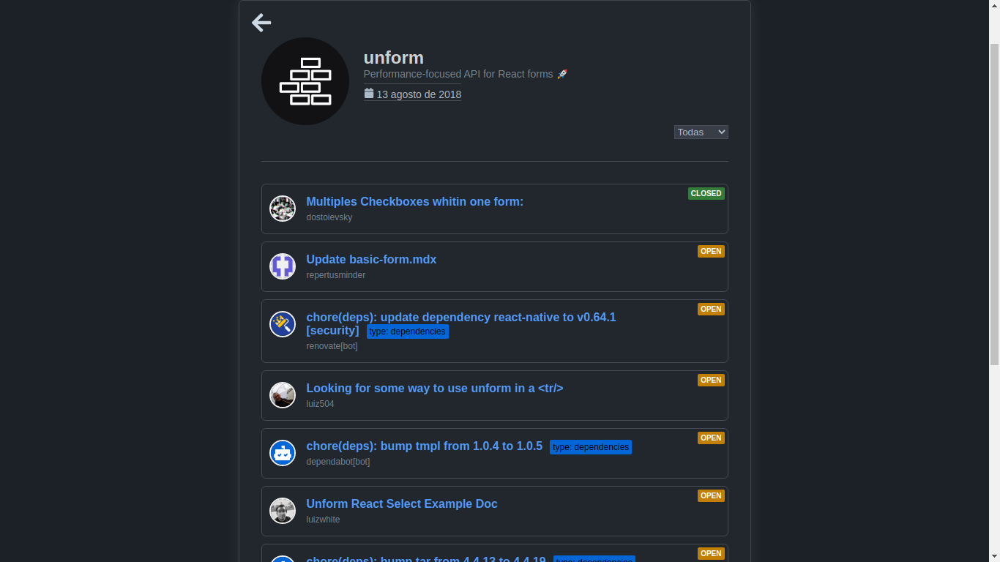

<h1 align="center">
    
</h1>

<h3 align="center">
  Projeto: Usando API do GotHub
</h3>

  <a href="#rocket-sobre-o-projeto">Sobre o projeto</a>&nbsp;&nbsp;&nbsp;|&nbsp;&nbsp;&nbsp;
  <a href="#heavy_check_mark-resultado-do-projeto">Resultado</a>&nbsp;&nbsp;&nbsp;|&nbsp;&nbsp;&nbsp;
  <a href="#pencil2-comentário">Conmentário</a>

## :rocket: Sobre o projeto

Criar um página com React capaz de consumir alguns recursos da <a href='https://docs.github.com/pt/rest'>API do github</a> a página poderá inserir repositórios, ver detalhes de um dado repositório inserido e também as issues abertas.

## :heavy_check_mark: Resultado do projeto

<figure>
  
  <figcaption>Tela para adicionar repositórios.</figcaption>
</figure>

<figure>
  
  <figcaption>Tela para os detalhes do repositório</figcaption>
</figure>

## :pencil2: Comentário

Aqui utilizei apenas componentes funcionais para estruturar toda a plicação. Além disso, utilizei bibliotecas interessantes tais como `axios`, `date-fns`, `styled-components` e muito mais.

