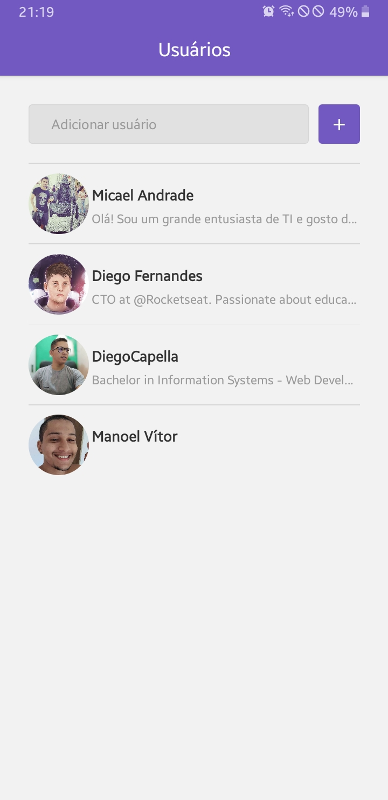
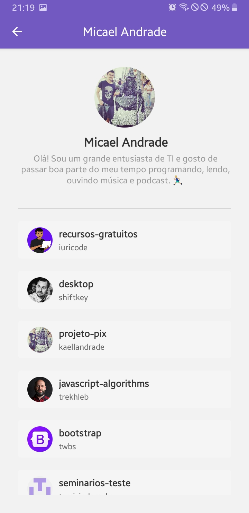
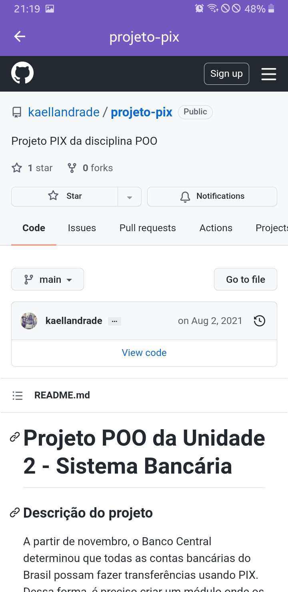

<h1 align="center">
    
</h1>

<h3 align="center">
  Projeto: Usando API do GitHub (Primeiro Projeto com React Native)
</h3>

  <a href="#rocket-sobre-o-projeto">Sobre o projeto</a>&nbsp;&nbsp;&nbsp;|&nbsp;&nbsp;&nbsp;
  <a href="#heavy_check_mark-resultado-do-projeto">Resultado</a>&nbsp;&nbsp;&nbsp;|&nbsp;&nbsp;&nbsp;
  <a href="#pencil2-comentário">Comentário</a>

## :rocket: Sobre o projeto

Criar um aplicativo com React Native capaz de consumir alguns recursos da <a href='https://docs.github.com/pt/rest'>API do github</a>. O App poderá inserir usuários, ver detalhes de um dado usuário, e seus repositórios favoritados.

## :heavy_check_mark: Resultado do projeto

  
  
  

## :pencil2: Comentário

Aqui utilizei apenas componentes funcionais para estruturar toda a plicação. Além disso, utilizei bibliotecas interessantes tais como `axios`, `Webview`, `styled-components` e muito mais. Aqui também foi utilizado o `asyncstorage` do celular para armazear os dados, pois assim não perdemos nossos dados após fechar o aplicativo. <a href='https://kaellandrade.github.io/GoStack_Bootcamp/'>Página do projeto.</a>
