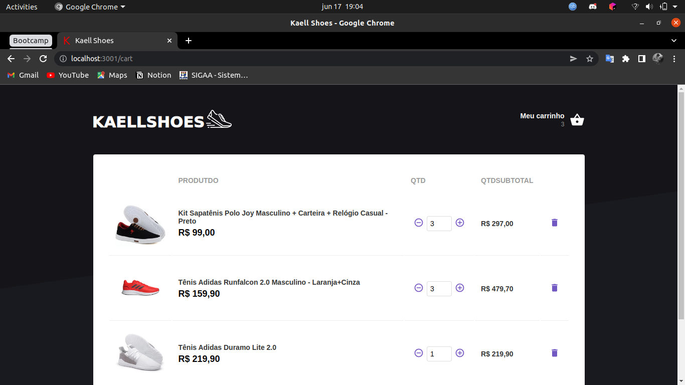

<h1 align="center">
    
</h1>

<h3 align="center">
  Projeto: Ecommerce Calçados Kaell Shoes
</h3>

  <a href="#rocket-sobre-o-projeto">Sobre o projeto</a>&nbsp;&nbsp;&nbsp;|&nbsp;&nbsp;&nbsp;
  <a href="#heavy_check_mark-resultado-do-projeto">Resultado</a>&nbsp;&nbsp;&nbsp;|&nbsp;&nbsp;&nbsp;
  <a href="#pencil2-comentário">Comentário</a>

## :rocket: Sobre o projeto

Criar uma página de Ecommerce para calçados utilizando a arquiterura Flux / Redux com Saga.

## :heavy_check_mark: Resultado do projeto

<figure>
    
    <figcaption>Tela inicial dos produtos</figcaption>
</figure>

<figure>
    
    <figcaption>Tela inicial dos produtos</figcaption>
</figure>

<figure>
    
    <figcaption>Produto excedeu o estoque disponível</figcaption>
</figure>

<figure>
    
    <figcaption>Contablilizando no carrinho</figcaption>
</figure>

<figure>
    
    <figcaption>Carrinho</figcaption>
</figure>

<figure>
    
    <figcaption>Alterando itens</figcaption>
</figure>

## :pencil2: Comentário

Aqui utilizei apenas componentes funcionais para estruturar toda a plicação. Além disso, utilizei bibliotecas
interessantes tais como `axios`, `date-fns`, `styled-components` e muito mais. Aqui também foi utilizado
o `localstorage` do navegador para armazear os dados, pois assim não perdemos nossos dados após atualizar a
página. <a href='https://kaellandrade.github.io/GoStack_Bootcamp/'>Página do projeto.</a>
